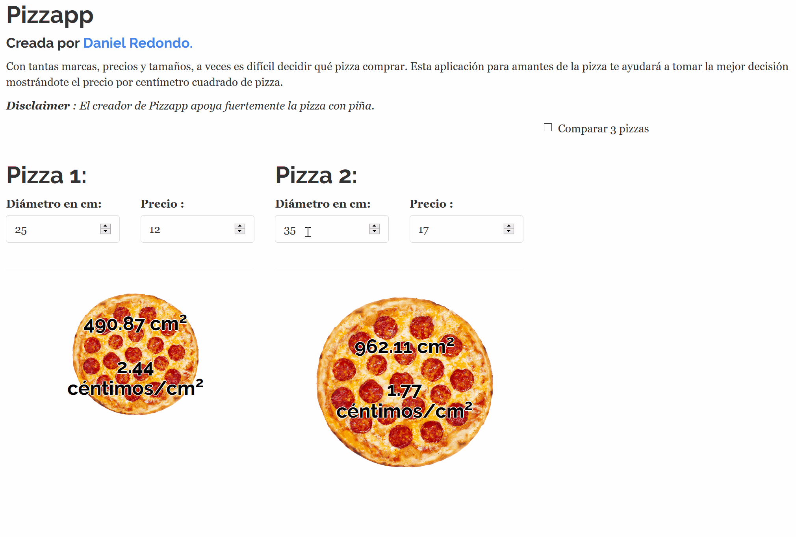

# Pizzapp

Con tantas marcas, precios y tamaños, a veces es difícil decidir qué pizza comprar. Esta aplicación para amantes de la pizza te ayudará a tomar la mejor decisión mostrándote el precio por centímetro cuadrado de pizza. Pizzapp es una aplicación web hecha por [Daniel Redondo](https://danielredondo.com/) con R y Shiny.

*Disclaimer*: El creador de Pizzapp apoya fuertemente la pizza con piña.

En este gif puedes ver su funcionamiento:

